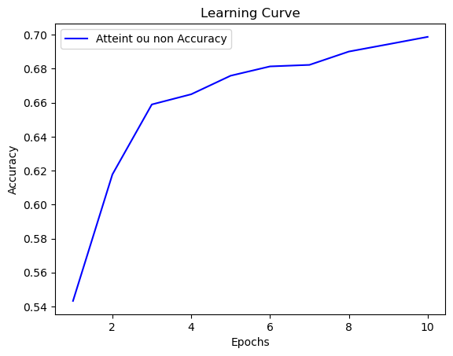
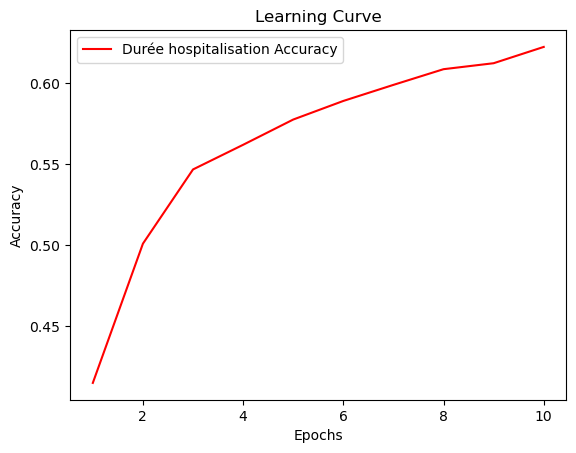

# Health Time Series Analysis using Multi-Task Gradient Descent with Transformer Encoder Architecture

This project implements a multi-task gradient descent approach for health time series analysis using a transformer encoder architecture. The goal is to analyze health-related time series data and make predictions or extract meaningful insights from the data.

## Table of Contents

- [Introduction](#introduction)
- [Data](#data)
- [Model Architecture](#model-architecture)
- [Results](#results)

## Introduction

In this project, we propose a multi-task gradient descent approach for health time series analysis. The main idea is to leverage the power of transformer encoder architecture to model the temporal dependencies in the data and perform multiple tasks simultaneously, such as prediction, classification, or anomaly detection.

## Data

The project uses the MIMIC-IV databse which contains health-related time series data. The database is available at https://physionet.org/content/mimiciv/1.0/.

## Model Architecture

The model architecture used in this project is based on the transformer encoder. It consists of multiple encoder layers, attention mechanisms, and feed-forward neural networks. We incorporate multi-task gradient descent into the encoder architecture to perform multiple tasks simultaneously.

## Multi-Task Gradient Descent

Our multi-task gradient descent approach is based on an ongoing paper from a research group at the University of Paris-Saclay with whom we worked throughout the project. The paper is still not available but the main idea is 

## Results

We evaluate our model on the MIMIC-IV database and compare it to other models, including standard RNN models which are considered as the state-of-the-art in health time series analysis. The results show that our model outperforms the other models in terms of prediction accuracy and anomaly detection. Our model is also able to perform multiple tasks simultaneously, such as prediction and classification, classification and regularization etc. Below are some of the results obtained from our model when trained for sepsis diagnosis and mortality prediction.

    

        
    

    

        
    

